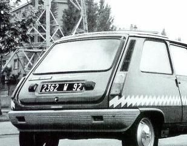

# Formatage de base

## Un paragraphe

This paper elaborates on part of a chapter of my ongoing doctoral research on
electric vehicle (EV) projects in Germany and France in the 1970s. I will
present some preliminary findings from test reports and technical documents
produced on these vehicles. The main contention of the paper is that the main
defects of 1970s-era electric vehicles were due to maintenance and
reliability.

Aliquam dapibus aliquam tempus. Suspendisse non nibh tristique, venenatis justo
ac, sagittis ante. Nam commodo dictum quam, id tempus erat congue sit amet.
Phasellus sed elit in enim congue molestie. Suspendisse turpis orci, feugiat ac
porta in, venenatis quis est. Ut eros mauris, molestie vestibulum mauris quis,
fringilla vulputate justo. Pellentesque est ligula, condimentum ut ante non,
maximus viverra sem. Pellentesque lacus nibh, ultrices quis convallis in,
ultrices at diam. Cras sagittis nisi eu arcu porttitor volutpat.

## Gras et italique

Markdown permet d'indiquer le gras et l'italique en utilisant deux sytaxes
différentes. La première, c'est un astérisk autour du mot pour *l'italique*, et
deux pour du **gras**. La même chose est possible avec des tirets bas, dont un
tiret indique _italique_ et deux indiquent __gras__.

*Aliquam dapibus aliquam tempus. Suspendisse non nibh tristique, venenatis justo
ac, sagittis ante. Nam commodo dictum quam, id tempus erat congue sit amet.
Phasellus sed elit in enim congue molestie. Suspendisse turpis orci, feugiat ac
porta in, venenatis quis est. Ut eros mauris, molestie vestibulum mauris quis,
fringilla vulputate justo. Pellentesque est ligula, condimentum ut ante non,
maximus viverra sem. Pellentesque lacus nibh, ultrices quis convallis in,
ultrices at diam. Cras sagittis nisi eu arcu porttitor volutpat.*

**Donec commodo magna a faucibus suscipit. Nulla purus purus, blandit vitae
mauris vel, mollis feugiat justo. Sed accumsan vehicula sodales. Ut eget
consectetur tellus. Cras nisi orci, porta vel felis sit amet, dictum vestibulum
urna. Duis ac viverra purus, a pharetra nisi. Morbi nunc metus, gravida aliquet
varius non, posuere id augue. Sed commodo sapien finibus tincidunt vehicula.
Mauris metus metus, eleifend a odio sit amet, aliquet lacinia mauris. Aliquam
eget ullamcorper dui. Nulla id ornare sapien. Nulla viverra, ipsum sed molestie
sagittis, nisl erat ultricies neque, non malesuada velit sem sed orci.**

## Listes

Suspendisse finibus consequat aliquam. Quisque rhoncus placerat vestibulum.
Suspendisse sagittis aliquet ligula vel pretium. Phasellus id tincidunt nibh. In
egestas ultrices fringilla. Vivamus at scelerisque ipsum.

- Donec egestas augue nec sem vulputate,
- vitae pellentesque quam consectetur.
- Proin ut lorem vitae nisl condimentum vestibulum eu non leo.
- Ut ante neque, rhoncus non porta ut, ullamcorper a mi.
- Maecenas viverra urna vel aliquam mollis.

Nulla semper, justo sagittis vestibulum posuere, elit odio maximus
mauris, sed porta arcu dui vitae nibh. Suspendisse eros lacus, varius vitae
volutpat non, luctus vel nisl. Maecenas erat augue, congue vitae ultricies id,
placerat eu nibh.

1. Suspendisse sit amet posuere urna.
2. Aenean facilisis id nisl a elementum.
3. Phasellus ut nisi interdum, convallis augue in, malesuada sem.
1. Morbi sodales nibh dui, eu pulvinar dolor commodo id.
1. Sed porttitor arcu at ultrices lacinia.
1. Vivamus finibus turpis quis lectus varius molestie a sed libero.

Vivamus elementum rhoncus ipsum, quis efficitur nisl euismod sed. Vivamus a
ornare magna. Donec cursus aliquet sodales. Sed massa felis, blandit ut risus
gravida, pellentesque lacinia odio.

## Liens

Lorem ipsum dolor sit amet, consectetur adipiscing elit. [Sous ce lien vous trouvez le manuel de Pandoc.](https://pandoc.org/MANUAL.html) Sed vehicula,
lacus ac fringilla commodo, libero justo commodo dui, a gravida leo elit non
justo. Praesent justo nisl, dictum non libero a, lacinia posuere nibh. Vivamus
non aliquam est. Curabitur dictum massa velit, nec egestas nunc consectetur sed.
Nullam volutpat tincidunt purus. Proin malesuada gravida nulla luctus maximus.
Mauris efficitur laoreet eros, at finibus mauris efficitur vitae. Donec tempor
sapien sed nisl eleifend laoreet. Morbi ultricies mauris ut interdum suscipit.
Praesent urna magna, vulputate ut metus at, tempor luctus mi.

# Notes et citations

## Notes

Donec commodo magna a faucibus suscipit.^[Une note dans le texte. On peut également copier et coller des références à partir de Zotero : Hughes, Thomas P. _Networks of Power._ Baltimore: Johns Hopkins University Press, 1983.]
Nulla purus purus, blandit vitae mauris vel, mollis feugiat justo. Sed accumsan
vehicula sodales. Ut eget consectetur tellus. Cras nisi orci, porta vel felis
sit amet, dictum vestibulum urna. Duis ac viverra purus, a pharetra nisi.[^note]
Morbi nunc metus, gravida aliquet varius non, posuere id augue. Sed commodo
sapien finibus tincidunt vehicula. Mauris metus metus, eleifend a odio sit amet,
aliquet lacinia mauris. Aliquam eget ullamcorper dui.[^note-longue] Nulla id
ornare sapien. Nulla viverra, ipsum sed molestie sagittis, nisl erat ultricies
neque, non malesuada velit sem sed orci.

[^note]: Voici une note séparé de l'endroit où elle apparaît dans le texte. Elle
ne contient qu'un seul paragraphe.

## Citations

Mauris metus metus, eleifend a odio sit amet,
aliquet lacinia mauris. Aliquam eget ullamcorper dui. Nulla id ornare sapien.
Nulla viverra, ipsum sed molestie sagittis, nisl erat ultricies neque, non
malesuada velit sem sed orci.[@http://zotero.org/users/2663066/items/UXDSE6HB, 15]

Suspendisse sit amet posuere
urna.[@http://zotero.org/users/2663066/items/UXDSE6HB, chap. 2] Aenean
facilisis id nisl a elementum. Phasellus ut nisi interdum, convallis augue in,
malesuada sem. Morbi sodales nibh dui, eu pulvinar dolor commodo id. Sed
porttitor arcu at ultrices lacinia. Vivamus finibus turpis quis lectus varius
molestie a sed libero. Vivamus elementum rhoncus ipsum, quis efficitur nisl
euismod sed. Vivamus a ornare magna. Donec cursus aliquet sodales. Sed massa
felis, blandit ut risus gravida, pellentesque lacinia
odio.[@http://zotero.org/users/2663066/items/WEUCCBFV; See also @http://zotero.org/users/2663066/items/SWG48GEF]

Donec commodo magna a faucibus suscipit. Nulla purus purus, blandit vitae mauris
vel, mollis feugiat justo.[For an earlier study, see @http://zotero.org/users/2663066/items/VSWI74DN 22] Sed accumsan vehicula
sodales. Ut eget consectetur tellus. Cras nisi orci, porta vel felis sit amet,
dictum vestibulum urna. Duis ac viverra purus, a pharetra nisi. Morbi nunc
metus, gravida aliquet varius non, posuere id
augue.[@http://zotero.org/users/2663066/items/TJWBMFNQ] Sed commodo sapien
finibus tincidunt vehicula.

Aliquam dapibus aliquam tempus. Suspendisse non nibh tristique, venenatis justo
ac, sagittis ante. Nam commodo dictum quam, id tempus erat congue sit amet.
Phasellus sed elit in enim congue molestie. Suspendisse turpis orci, feugiat ac
porta in, venenatis quis est.[@http://zotero.org/users/2663066/items/UXDSE6HB, 322]

## Citations dans le texte

Il est possible d'intégrer des citations "en bloc" dans le texte en utilisant la
forme qu'on connaît des e-mails avec un ">" au début de chaque ligne.

> Donec commodo magna a faucibus suscipit. Nulla purus purus, blandit vitae
> vel, mollis feugiat justo. Sed accumsan vehicula sodales. Ut eget consectetur
> tellus. Cras nisi orci, porta vel felis sit amet, dictum vestibulum urna. Duis
> ac viverra purus, a pharetra nisi. Morbi nunc metus, gravida aliquet varius,
> posuere id augue. Sed commodo sapien finibus tincidunt vehicula.

Une version simplifiée est également permise avec un seul ">" au début de la
première ligne du paragraphe uniquement.

> Mauris metus metus, eleifend a odio sit amet, aliquet lacinia mauris. Aliquam
eget ullamcorper dui. Nulla id ornare sapien. Nulla viverra, ipsum sed molestie
sagittis, nisl erat ultricies neque, non malesuada velit sem sed orci.

# Tableaux et images

Lorem ipsum dolor sit amet, consectetur adipiscing elit. Sed vehicula, lacus ac
fringilla commodo, libero justo commodo dui, a gravida leo elit non justo.
Praesent justo nisl, dictum non libero a, lacinia posuere nibh. Vivamus non
aliquam est. Curabitur dictum massa velit, nec egestas nunc consectetur sed.
Nullam volutpat tincidunt purus. Proin malesuada gravida nulla luctus maximus.
Mauris efficitur laoreet eros, at finibus mauris efficitur vitae. Donec tempor
sapien sed nisl eleifend laoreet. Morbi ultricies mauris ut interdum suscipit.
Praesent urna magna, vulputate ut metus at, tempor luctus mi.

## Tableaux

Donec commodo magna a faucibus suscipit. Nulla purus purus, blandit vitae mauris vel, mollis feugiat justo. Sed accumsan vehicula sodales. Ut eget consectetur tellus. Cras nisi orci, porta vel felis sit amet, dictum vestibulum urna. Duis ac viverra purus, a pharetra nisi. Morbi nunc metus, gravida aliquet varius non, posuere id augue. Sed commodo sapien finibus tincidunt vehicula. Mauris metus metus, eleifend a odio sit amet, aliquet lacinia mauris. Aliquam eget ullamcorper dui. Nulla id ornare sapien. Nulla viverra, ipsum sed molestie sagittis, nisl erat ultricies neque, non malesuada velit sem sed orci.

| Format      | File extension |
|-------------|----------------|
| BibLaTeX    | .bib           |
| BibTeX      | .bibtex        |
| Copac       | .copac         |
| CSL JSON    | .json          |
| CSL YAML    | .yaml          |
| EndNote     | .enl           |
| EndNote XML | .xml           |
| ISI         | .wos           |
| MEDLINE     | .medline       |
| MODS        | .mods          |
| RIS         | .ris           |

: Formats de bibliographie compatibles avec Pandoc.

Lorem ipsum dolor sit amet, consectetur adipiscing elit. Sed vehicula, lacus ac
fringilla commodo, libero justo commodo dui, a gravida leo elit non justo.
Praesent justo nisl, dictum non libero a, lacinia posuere nibh. Vivamus non
aliquam est. Curabitur dictum massa velit, nec egestas nunc consectetur sed.
Nullam volutpat tincidunt purus. Proin malesuada gravida nulla luctus maximus.
Mauris efficitur laoreet eros, at finibus mauris efficitur vitae. Donec tempor
sapien sed nisl eleifend laoreet. Morbi ultricies mauris ut interdum suscipit.
Praesent urna magna, vulputate ut metus at, tempor luctus mi.

Donec commodo magna a faucibus suscipit. Nulla purus purus, blandit vitae mauris
vel, mollis feugiat justo. Sed accumsan vehicula sodales. Ut eget consectetur
tellus. Cras nisi orci, porta vel felis sit amet, dictum vestibulum urna. Duis
ac viverra purus, a pharetra nisi. Morbi nunc metus, gravida aliquet varius non,
posuere id augue. Sed commodo sapien finibus tincidunt vehicula. Mauris metus
metus, eleifend a odio sit amet, aliquet lacinia mauris. Aliquam eget
ullamcorper dui. Nulla id ornare sapien. Nulla viverra, ipsum sed molestie
sagittis, nisl erat ultricies neque, non malesuada velit sem sed orci. Aliquam
dapibus aliquam tempus. Suspendisse non nibh tristique, venenatis justo ac,
sagittis ante. Nam commodo dictum quam, id tempus erat congue sit amet.
Phasellus sed elit in enim congue molestie. Suspendisse turpis orci, feugiat ac
porta in, venenatis quis est. Ut eros mauris, molestie vestibulum mauris quis,
fringilla vulputate justo. Pellentesque est ligula, condimentum ut ante non,
maximus viverra sem. Pellentesque lacus nibh, ultrices quis convallis in,
ultrices at diam. Cras sagittis nisi eu arcu porttitor volutpat.

\begin{table}
\caption[Development of RWE's and EDF's energy inputs in percent]{Development of RWE's and EDF's energy inputs in percent}
  \centering
    \begin{tabular}{lllll}
    \toprule
      & \multicolumn{2}{c}{RWE} & \multicolumn{2}{c}{EDF} \\
      \cmidrule(rl){2-3} \cmidrule(rl){4-5}
      Energy Source & 1973   & 1980   & 1974   & 1979     \\
      \midrule
      Lignite       & 56,4   & 59,8   &  0,4   & 0,3      \\
      Hard Coal     & 32,5   & 20,2   &  8,9   & 22,9     \\
      Hydro         & 6,6    & 5,0    &  36,2  & 31,8     \\
      Oil \& Gas    & 3,1    & 0,8    &  45,2  & 25,7     \\
      Nuclear       & 1,4    & 10,1   &  8,5   & 18,7     \\
      \bottomrule
    \end{tabular}
\end{table}

## Images

Donec commodo magna a faucibus suscipit. Nulla purus purus, blandit vitae mauris
vel, mollis feugiat justo. Sed accumsan vehicula sodales. Ut eget consectetur
tellus. Cras nisi orci, porta vel felis sit amet, dictum vestibulum urna. Duis
ac viverra purus, a pharetra nisi. Morbi nunc metus, gravida aliquet varius non,
posuere id augue. Sed commodo sapien finibus tincidunt vehicula. Mauris metus
metus, eleifend a odio sit amet, aliquet lacinia mauris. Aliquam eget
ullamcorper dui. Nulla id ornare sapien. Nulla viverra, ipsum sed molestie
sagittis, nisl erat ultricies neque, non malesuada velit sem sed orci.

Aliquam dapibus aliquam tempus. Suspendisse non nibh tristique, venenatis justo
ac, sagittis ante. Nam commodo dictum quam, id tempus erat congue sit amet.
Phasellus sed elit in enim congue molestie. Suspendisse turpis orci, feugiat ac
porta in, venenatis quis est. Ut eros mauris, molestie vestibulum mauris quis,
fringilla vulputate justo. Pellentesque est ligula, condimentum ut ante non,
maximus viverra sem. Pellentesque lacus nibh, ultrices quis convallis in,
ultrices at diam. Cras sagittis nisi eu arcu porttitor volutpat.

Donec commodo magna a faucibus suscipit. Nulla purus purus, blandit vitae mauris
vel, mollis feugiat justo. Sed accumsan vehicula sodales. Ut eget consectetur
tellus. Cras nisi orci, porta vel felis sit amet, dictum vestibulum urna. Duis
ac viverra purus, a pharetra nisi. Morbi nunc metus, gravida aliquet varius non,
posuere id augue. Sed commodo sapien finibus tincidunt vehicula. Mauris metus
metus, eleifend a odio sit amet, aliquet lacinia mauris. Aliquam eget
ullamcorper dui. Nulla id ornare sapien. Nulla viverra, ipsum sed molestie
sagittis, nisl erat ultricies neque, non malesuada velit sem sed orci.

Suspendisse finibus consequat aliquam. Quisque rhoncus placerat vestibulum.
Suspendisse sagittis aliquet ligula vel pretium. Phasellus id tincidunt nibh. In
egestas ultrices fringilla. Vivamus at scelerisque ipsum. Donec egestas augue
nec sem vulputate, vitae pellentesque quam consectetur. Proin ut lorem vitae
nisl condimentum vestibulum eu non leo. Ut ante neque, rhoncus non porta ut,
ullamcorper a mi. Maecenas viverra urna vel aliquam mollis. Nulla semper, justo
sagittis vestibulum posuere, elit odio maximus mauris, sed porta arcu dui vitae
nibh. Suspendisse eros lacus, varius vitae volutpat non, luctus vel nisl.
Maecenas erat augue, congue vitae ultricies id, placerat eu nibh.

### Une sous-sous section pour finir

<!-- Enfin, On peut intégrer des commentaires dans cette forme, qui
n'aparaissent pas dans le texte fini. -->

Lorem ipsum dolor sit amet, consectetur adipiscing elit. Sed vehicula, lacus ac
fringilla commodo, libero justo commodo dui, a gravida leo elit non justo.
Praesent justo nisl, dictum non libero a, lacinia posuere nibh. Vivamus non
aliquam est. Curabitur dictum massa velit, nec egestas nunc consectetur sed.
Nullam volutpat tincidunt purus. Proin malesuada gravida nulla luctus maximus.
Mauris efficitur laoreet eros, at finibus mauris efficitur vitae. Donec tempor
sapien sed nisl eleifend laoreet. Morbi ultricies mauris ut interdum suscipit.
Praesent urna magna, vulputate ut metus at, tempor luctus mi.

Aliquam dapibus aliquam tempus. Suspendisse non nibh tristique, venenatis justo
ac, sagittis ante. Nam commodo dictum quam, id tempus erat congue sit amet.
Phasellus sed elit in enim congue molestie. Suspendisse turpis orci, feugiat ac
porta in, venenatis quis est. Ut eros mauris, molestie vestibulum mauris quis,
fringilla vulputate justo. Pellentesque est ligula, condimentum ut ante non,
maximus viverra sem. Pellentesque lacus nibh, ultrices quis convallis in,
ultrices at diam. Cras sagittis nisi eu arcu porttitor volutpat.

Donec commodo magna a faucibus suscipit. Nulla purus purus, blandit vitae mauris
vel, mollis feugiat justo. Sed accumsan vehicula sodales. Ut eget consectetur
tellus. Cras nisi orci, porta vel felis sit amet, dictum vestibulum urna. Duis
ac viverra purus, a pharetra nisi. Morbi nunc metus, gravida aliquet varius non,
posuere id augue. Sed commodo sapien finibus tincidunt vehicula. Mauris metus
metus, eleifend a odio sit amet, aliquet lacinia mauris. Aliquam eget
ullamcorper dui. Nulla id ornare sapien. Nulla viverra, ipsum sed molestie
sagittis, nisl erat ultricies neque, non malesuada velit sem sed orci.

# Références

[^note-longue]: Une note également séparée de l'endroit où elle apparaît.

    Un deuxième paragraphe de la note longue, avec un peu de retrait pour
    indiquer qu'il fait partie de la note précédente.

    On peut en ajouter autant de paragraphes qu'on veut, c'est très utile pour
    des historiens qui aiment bien des longues notes.
