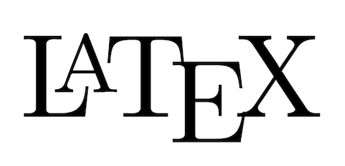
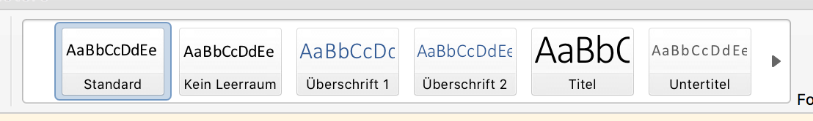
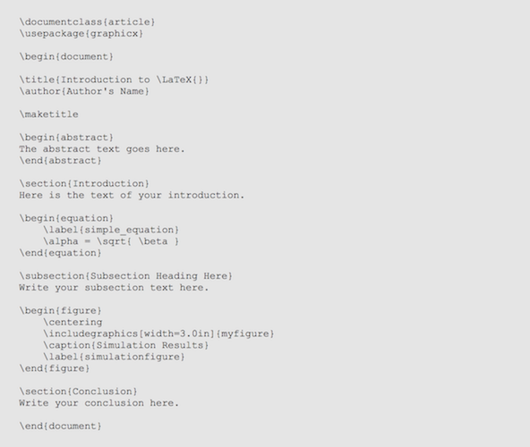
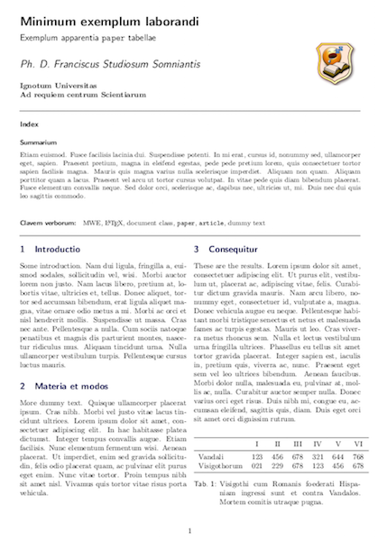
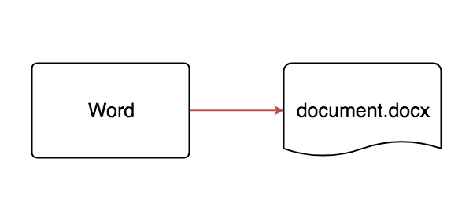
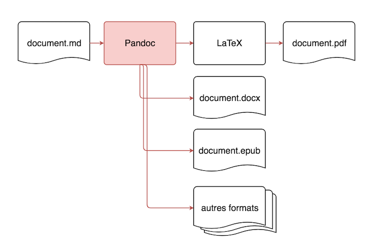
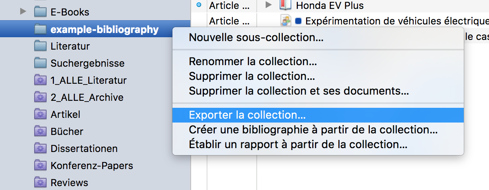
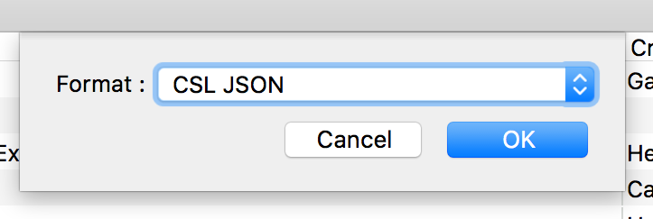

# 1 - Introduction

## Qu'allons-nous faire aujourd'hui ?

- Convertir des documents
- Apprendre à écrire dans la syntaxe Markdown
- Intégrer des références bibliographiques
- Générer les plus beaux documents du monde sans utiliser Microsoft Word

## Ce que nous n'allons pas faire...

- Apprendre du LaTeX (sorry)
- Découvrir le système « parfait » d'écriture
- Tout mémoriser

## Pourquoi ?

- Séparer écriture et mise en page
- Plus de flexibilité en termes de :
    - choix de format
    - choix d'éditeur de texte
    - choix de « workflow »
    - choix de structure

## Why Microsoft Word must die

<http://www.antipope.org/charlie/blog-static/2013/10/why-microsoft-word-must-die.html>

## Choisir son camp

\ 

## LaTeX

<!-- Add forced line break to avoid images being treated as figures,
    therefore suppressing captions showing up -->

 \

## LaTeX ?

- Un système de composition de documents
- Une langue de balisage (Markup language)
- Un logiciel de conversion de documents
- Publié par Leslie Lamport en 1984
- Collection de macros pour le langage TeX (1976)

## La différence avec Word

- Word : What you see is what you get (WYSIWYG)
- LaTeX : What you see is what you _mean_ (WYSIWYM)

--------------------

 \

## Avantages

- Force l'utilisateur à bien structurer ses documents
- Formatage très précis aux standards de l'imprimerie
- Développé par et pour des académiques
- Durable, car source en texte brut
- Libre, open source et gratuit

## Désavantages

- Compliqué à apprendre
- Moins visuel que Word
- Peu répandu en sciences humaines
- Difficile à lire au niveau de la source
- Incompatible avec Word

## Exemple

 \

--------------------

 \

---------

Est-ce que c'est compliqué ?

---------

    \documentclass{article}
    \usepackage{graphicx}

----------

    \begin{document}

----------

    \title{Introduction to LaTeX}
    \author{Author's Name}

----------

    \maketitle

----------

    \begin{abstract}
    The abstract text goes here.
    \end{abstract}

----------

    \section{Introduction}
    Here is the text of your introduction.

----------

    \begin{equation}
        \label{simple_equation}
        \alpha = \sqrt{ \beta }
    \end{equation}

----------

    \subsection{Subsection Heading Here}
    Write your subsection text here.

----------

    \begin{figure}
        \centering
        \includegraphics[width=3.0in]{myfigure}
        \caption{Simulation Results}
        \label{simulationfigure}
    \end{figure}

----------

    \section{Conclusion}
    Write your conclusion here.

----------

    \end{document}

--------------------

 \

--------------------

 \

-------------------

Est-ce qu'on peut faire encore plus simple ?

## Markdown

- Langue de balisage simple (MarkDOWN != MarkUP)
- Permet de garder la source lisible
- Facile à convertir dans d'autres formats
- Très répandu sur le web (forums etc.)
- Publié en 2004 par John Gruber et Aaron Swartz

--------------------

> Markdown is intended to be as easy-to-read and easy-to-write as is feasible.

## Pandoc

- Un convertisseur de Markdown en d'autres formats
- Permet d'écrire du LaTeX sans devoir l'apprendre
- Accepte un mélange entre Markdown, LaTeX, HTML
- Libre, gratuit, open source, magique !
- Publié en 2007 par John McFarlane

## Résumé

## Word

 \

## LaTeX

 \

## Pandoc

 \

# 2 - Utiliser Pandoc

## Structure d'une commande

    pandoc <fichiers> --output <fichier sortie> <options>

## Forme pour les options

    pandoc ... --option <valeur>

### Exemples:

    --table-of-contents
    --bibliography example_bibliography.json
    --variable lang=fr

--------------------

    pandoc example_doc.md --output example_doc.pdf

--------------------

    pandoc ... --latex-engine xelatex

--------------------

    ...  --number-sections --table-of-contents

--------------------

    ... --variable lang=fr --variable geometry=a4paper

-------------------

    ... --variable documentclass=paper

## Intégrer des références

--------------------

    ... --filter pandoc-citeproc

--------------------

    ... --bibliography example_bibliography.json

--------------------

    ... --csl csl/universite-libre-de-bruxelles-histoire.csl

--------------------

    ... --csl csl/chicago-author-date.csl

-------------------

    ... --csl csl/universite-libre-de-bruxelles-histoire.csl

## Externaliser les options

--------------------

    pandoc example_doc.md example_metadata.yaml --output ...

--------------------

    ... --filter pandoc-citeproc --latex-engine xelatex

--------------------

example_metadata.yaml

    ---
      bibliography: example_bibliography.json
      csl: csl/universite-libre-de-bruxelles-histoire.csl

      lang: fr
      documentclass: scrartcl

      geometry: a4paper
      linestretch: 1.1

      linkcolor: black
      urlcolor: blue
      toc: true
      lot: true
    ---

--------------------

example_metadata.yaml

    numbersections: true

# 3 - Markdown

--------------------

Ouvrez example_doc.md

## Paragraphes

Délimité par au moins une ligne vide:

    Lorem ipsum dolor sit amet, consectetur adipiscing
    elit. Etiam tincidunt, orci et vestibulum ultricies,
    magna massa euismod ipsum, vel vulputate turpis
    ligula nec nulla.

    Etiam eu odio vehicula, cursus justo eget, porta neque.
    Pellentesque habitant morbi tristique senectus et
    netus et malesuada fames ac turpis egestas.

## Titres

    # niveau 1
    ## niveau 2
    ### niveau 3
    #### niveau 4
    ...

    niveau 1
    ========

    niveau 2
    --------

## Gras et italique

    *italique*
    _italique_

    **gras**
    __gras__

    ~~biffé~~

## Listes non ordonnées

    - on peut utiliser des tirets
    - comme ceci
    + ou bien des plus
    * quelque chose
    * les astérisques ça marche aussi
    + dernier point

## Listes ordonnées

    1. On peut
    2. faire attention
    3. aux chiffres
    1. ou pas
    1. Markdown
    1. va toujours
    5. rendre une liste
    2. incrémentelle

## Citations en bloc

    > Lorem ipsum dolor sit amet, consectetur adipiscing
    > elit. Etiam tincidunt, orci et vestibulum ultricies,
    > magna massa euismod ipsum,  vel vulputate turpis
    > ligula nec nulla.

    > Lorem ipsum dolor sit amet, consectetur adipiscing
    elit. Etiam tincidunt, orci et vestibulum ultricies,
    magna massa euismod ipsum, vel vulputate turpis ligula
    nec nulla.

## Notes

    Lorem ipsum dolor sit amet, consectetur adipiscing
    elit. ^[Un petit commentaire.]

    Lorem ipsum dolor sit amet, consectetur adipiscing
    elit.[^note]

    [^note]: Un petit commentaire.

## Liens

    Un lien vers [Wikipédia](http://fr.wikipedia.org).
    Un autre lien vers [Wikipédia][Adresse].
    Un lien simple vers <http://fr.wikipedia.org>.

    [Adresse]: http://fr.wikipedia.org

## Images

    
    
    ![Une autre pipe][trahison]

    [trahison]: /chemin/vers/trahison_des_images.jpg

NB: Une image qui se trouve toute seule dans un paragraphe sera
traité comme figure - il convient donc d'ajouter une légende.

## Tableaux 1

    | Format      | File extension |
    |-------------|----------------|
    | BibLaTeX    | .bib           |
    | BibTeX      | .bibtex        |
    | Copac       | .copac         |
    | CSL JSON    | .json          |
    | CSL YAML    | .yaml          |

## Tableaux 2

    +---------------+---------------+--------------------+
    | Fruit         | Price         | Advantages         |
    +===============+===============+====================+
    | Bananas       | $1.34         | - built-in wrapper |
    |               |               | - bright color     |
    +---------------+---------------+--------------------+
    | Oranges       | $2.10         | - cures scurvy     |
    |               |               | - tasty            |
    +---------------+---------------+--------------------+

## Commentaires (invisibles)

    <!-- Commentaire qui n'apparaît pas dans le résultat -->

## Métadonnées

    ---
      title: Bienvenue à l'atelier LaTeX !
      author:
        - Karsten Marhold
      date: 18/10/2017
    ---

-------------------

Les métadonnées peuvent apparaître :

- à la tête du document
- n'importe où dans le document
- dans un fichier séparé
- tout ce qui précède

# 4 - Bibliographie

## Plusieurs options

- Intégrer les références & bibliographie manuellement
- Copier-coller depuis Zotero
- Exporter de Zotéro

## Exporter depuis Zotero (1)

 \

## Exporter depuis Zotero (2)

 \

--------------------

example_bibliography.json

    [
    	{
    		"id": "http://zotero.org/users/2663066/items/UXDSE6HB",
    		"type": "book",
    		"title": "Networks of Power",
    		"publisher": "Johns Hopkins University Press",
    		"publisher-place": "Baltimore",
    		"event-place": "Baltimore",
    ...

--------------------

"id": "**http://zotero.org/users/2663066/items/UXDSE6HBÜ**"

## Citer des Sources

    Lorem ipsum dolor sit amet, consectetur adipiscing
    elit.[@http://zotero.org/users/2663066/items/UXDSE6HB, 22]

    Lorem ipsum dolor sit amet, consectetur adipiscing
    elit.[@http://zotero.org/users/2663066/items/UXDSE6HB,
    ch. 2]

    Lorem ipsum dolor sit amet, consectetur adipiscing
    elit.[@http://zotero.org/users/2663066/items/UXDSE6HB,
    part 3]

    Lorem ipsum dolor sit amet, consectetur adipiscing
    elit.[@http://zotero.org/users/2663066/items/UXDSE6HB, 2
    See also http://zotero.org/users/2663066/items/VSWI74DN,
    33, aussi chapitre 5]

## Rappel: style des citations

Lien vers le fichier CSL souhaité à indiquer dans les métadonnées.

      csl: csl/universite-libre-de-bruxelles-histoire.csl

-------------------

*Attention:* Toujours invoquer Pandoc avec `--filter pandoc-citeproc` !

## Fonctions de pandoc-citeproc

- Styles CSL configurables
- Reconnait citations récurrentes:
    - ibid.
    - op. cit.
- Reconnaît abbréviations tels que:
    - page, p., pg./chapter, ch., chap./volume, v., vol. ...
- Bibliographie automatique
    - sous la section "Références" si elle existe
    - sinon, à la fin du document

## Inconvénients

- ID peu lisible en format JSON
- Si l'on exporte en BibTeX, on perd des informations (mais l'ID
    reste lisible, ex. `@hughes_networks_1983`)
- Pas de mise à jour automatique : on doit exporter pour intégrer
    de nouvelles références

# 5 - Pratique

## Exercice 1

Convertissez example_doc.md en format PDF avec citations.

## Exercice 2

Convertissez example_doc.md en format DOCX avec citations.

## Exercice 3

Convertissez example_doc.md en format EPUB (e-book) avec citations.

## Exercice 4

Mettez la première phrase du document en gras et italique.

Convertissez le document en PDF.

## Exercice 5

Ajoutez une note en bas de page au premier paragraphe du document.

Convertissez le document en PDF.

## Exercice 6

Citez page 5 de l'article de Michel Callon à la fin du premier paragraphe.

Convertissez le document en PDF.

## Exercice 7

Changez le style de citation en Chicago Author-Date.

Convertissez le document en PDF.

## Exercice 8

Agrandissez l'espacement des lignes à 1.5.

Convertissez le document en PDF.

## Exercice 9

Ajoutez une liste des figures.

Astuce : l'option a la forme `toc: true`.

Convertissez le document en PDF.

## Exercice 10

Changez le type de document en « livre ».

Astuce : le type s'appele `book` ou `scrbook`.

Convertissez le document en PDF.

## Exercice BONUS

Créez votre propre document, citez une référence, ajoutez
la bibliographie.

Convertissez le document en PDF et en DOCX.

# 6 - Conclusion

## Que savez-vous faire maintenant ?

- Écrire une thèse dans Notepad !
- Formater un même texte en article, livre, rapport, mémoire...
- Changer le style de toutes vos citations en un coup de main
- Convertir votre document en PDF, DOC, EPUB, HTML, MediaWiki...

## Pandoc n'est pas parfait

- Pas mal de préparation nécessaire
- Google fait souvent office de documentation
- Changer les habitudes est difficile
- Interoperabilité pas toujours parfaite... (Zotero)

# 7 - Ressources

## Quelques liens

- <https://pandoc.org/MANUAL.html>
- <https://tex.stackexchange.com/>
- <https://github.com/adam-p/markdown-here/wiki/Markdown-Cheatsheet>
- <https://programminghistorian.org/lessons/sustainable-authorship-in-plain-text-using-pandoc-and-markdown>
- ...et plein d'autres...

## It's magic...

 \
